```{r initial, echo = FALSE, cache = FALSE, warning = FALSE, message = FALSE, error=FALSE, results = 'hide'}
library(knitr)
options(htmltools.dir.version = FALSE, tibble.width = 60)
knitr::opts_chunk$set(
  echo = TRUE, 
  warning = FALSE, 
  message = FALSE, 
  error=FALSE, 
  comment = "#>",
  collapse = TRUE,
  fig.path = 'figure/', 
  cache.path = 'cache/', 
  fig.align = 'center', 
  fig.width = 10, 
  fig.height = 7, 
  fig.show = 'hold', 
  cache = TRUE, 
  external = TRUE, 
  dev = 'svglite'
)
library(tidyverse)
library(ochRe)
library(tourr)
library(geozoo)
library(htmltools)
```

background-image: url(img/You_can't_see_beyond_3D.png)
background-size: contain

.left-column[
# High-dimensions
### You can't see beyond 3D
]
.right-column[

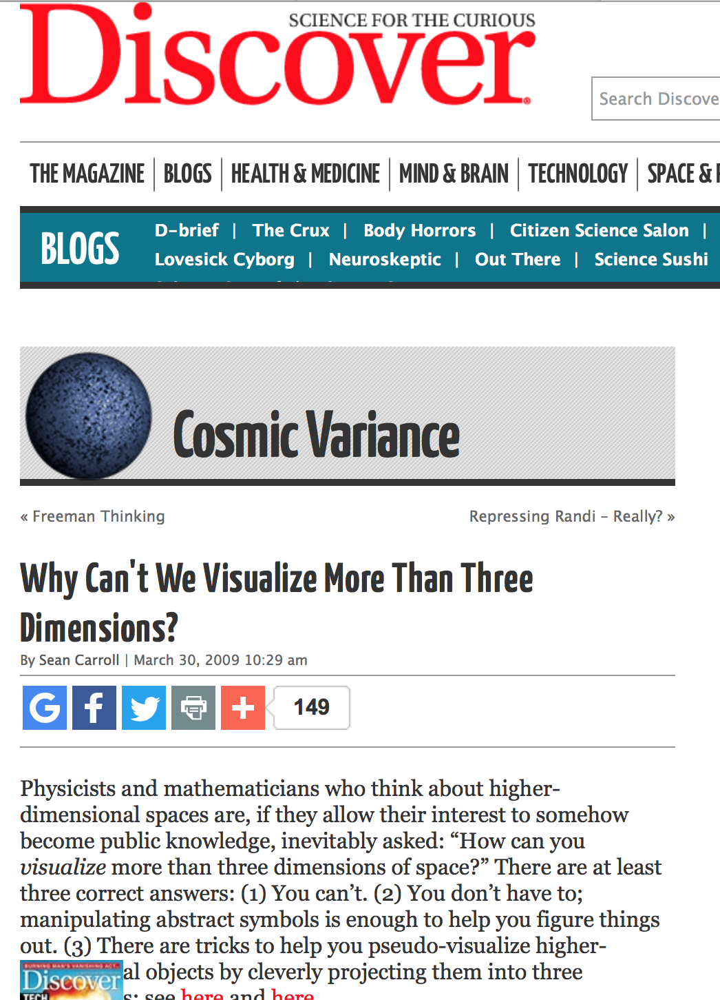
]

---
.left-column[
# High-dimensions
### You can't see beyond 3D
### A universe of 10 dimensions
]
.right-column[

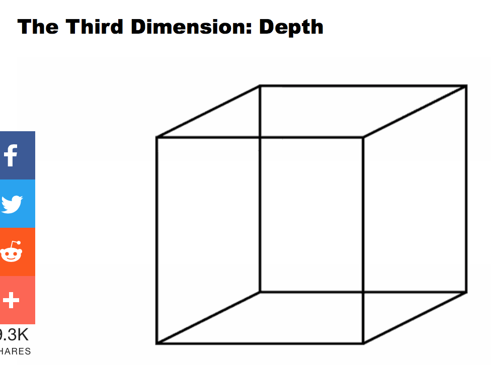

Source: https://ultraculture.org/blog/2014/12/16/heres-visual-guide-10-dimensions-reality/
]

---
.left-column[
# High-dimensions
### You can't see beyond 3D
### A universe of 10 dimensions
]
.right-column[

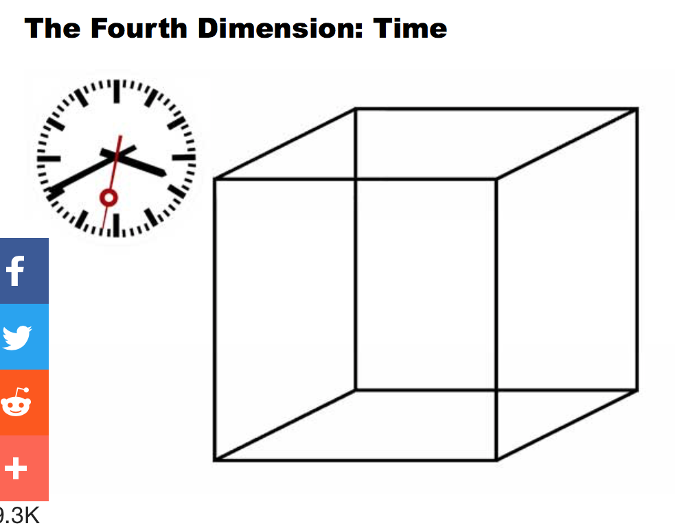

Source: https://ultraculture.org/blog/2014/12/16/heres-visual-guide-10-dimensions-reality/
]

---
.left-column[
# High-dimensions
### You can't see beyond 3D
### A universe of 10 dimensions
]
.right-column[

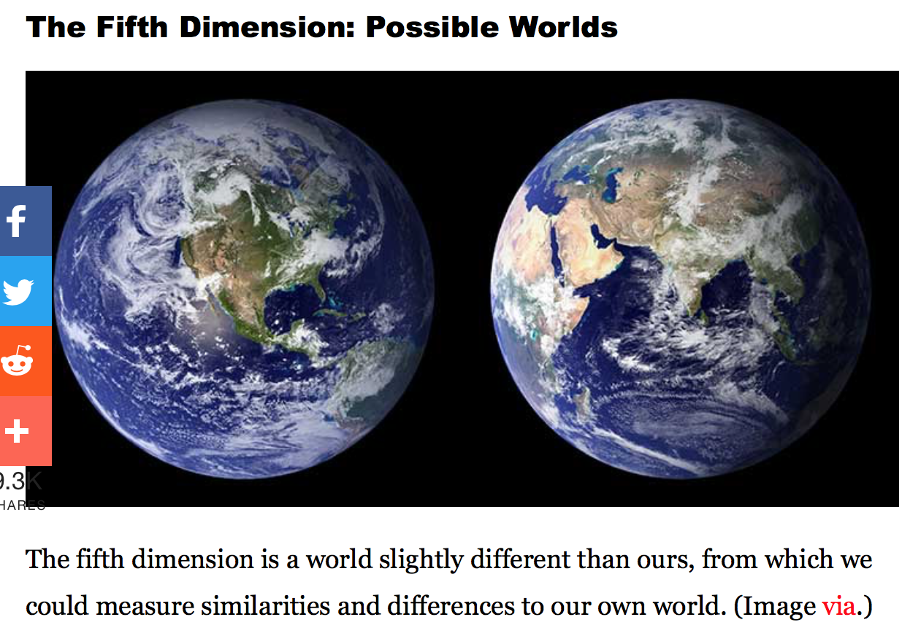

Source: https://ultraculture.org/blog/2014/12/16/heres-visual-guide-10-dimensions-reality/
]

---
.left-column[
# High-dimensions
### You can't see beyond 3D
### A universe of 10 dimensions
]
.right-column[

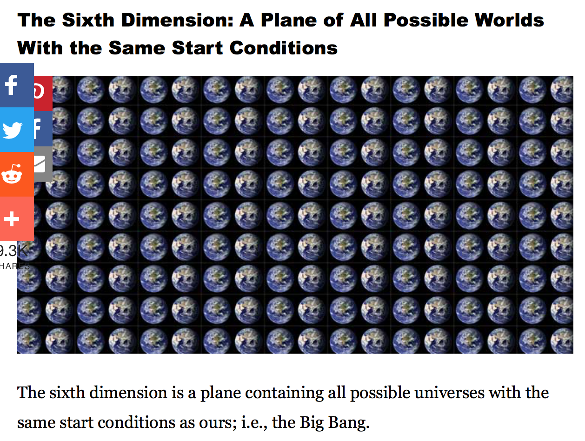

Source: https://ultraculture.org/blog/2014/12/16/heres-visual-guide-10-dimensions-reality/
]

---
.left-column[
# High-dimensions
### You can't see beyond 3D
### A universe of 10 dimensions
]
.right-column[

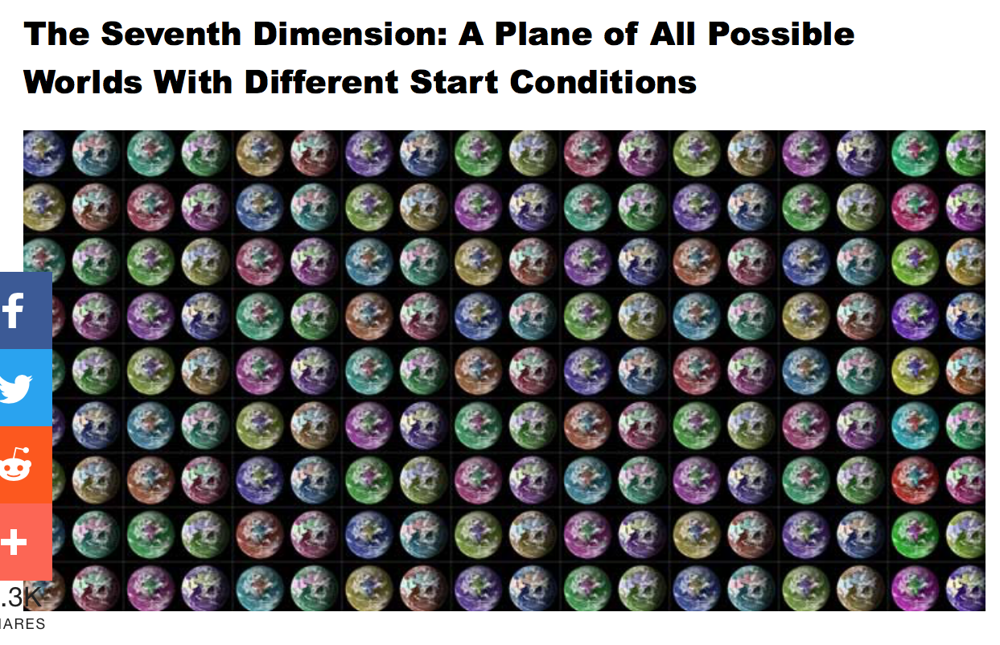

Source: https://ultraculture.org/blog/2014/12/16/heres-visual-guide-10-dimensions-reality/
]

---
.left-column[
# High-dimensions
### You can't see beyond 3D
### A universe of 10 dimensions
]
.right-column[

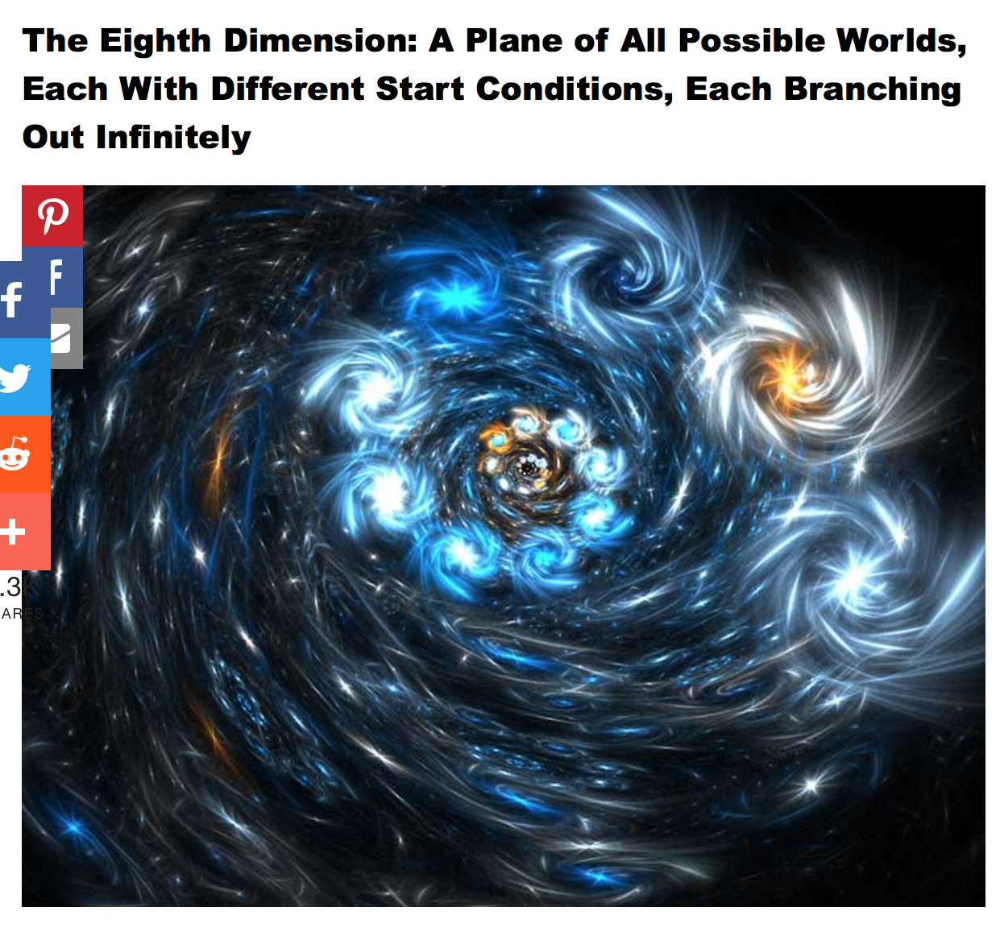

Source: https://ultraculture.org/blog/2014/12/16/heres-visual-guide-10-dimensions-reality/
]

---
.left-column[
# High-dimensions
### You can't see beyond 3D
### A universe of 10 dimensions
]
.right-column[

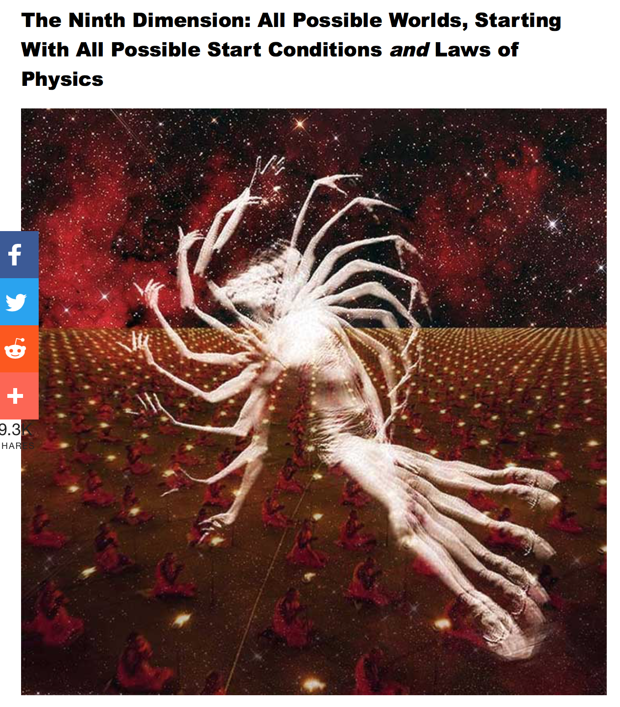

Source: https://ultraculture.org/blog/2014/12/16/heres-visual-guide-10-dimensions-reality/
]

---
.left-column[
# High-dimensions
### You can't see beyond 3D
### A universe of 10 dimensions
]
.right-column[

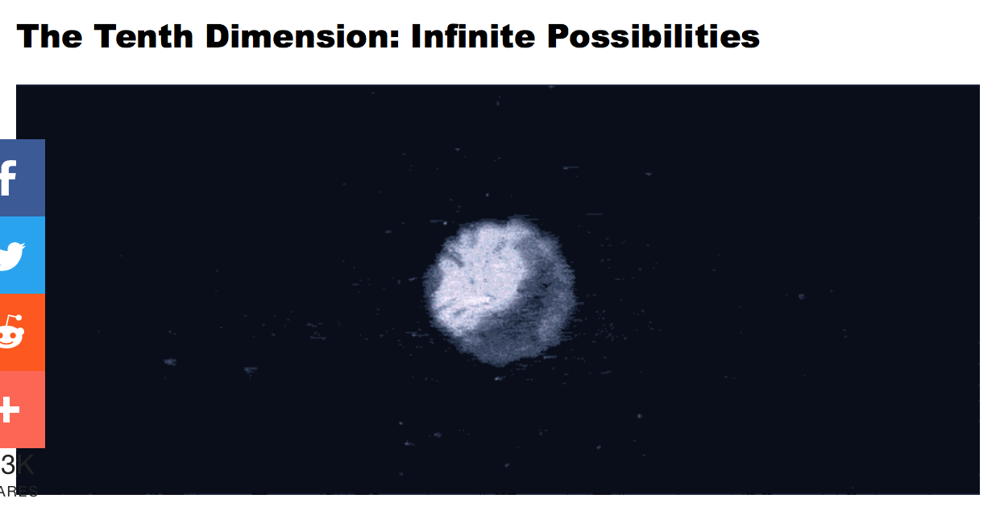

Source: https://ultraculture.org/blog/2014/12/16/heres-visual-guide-10-dimensions-reality/
]

---
class: inverse middle center

[Its not like that at all!](https://media1.tenor.com/images/d4c398703092842d4d17020b5414b0ee/tenor.gif?itemid=4995777)

---

.left-column[
# High-dimensions
### You can't see beyond 3D
### A universe of 10 dimensions
### Its more like...

[Flatland: A Romance of Many Dimensions (1884) Edwin Abbott Abbott](https://en.wikipedia.org/wiki/Flatland) 

]
.pull-right[


<p> 

The story describes a two-dimensional world occupied by geometric figures, where women are simple line-segments, and men are polygons with various numbers of sides.
]

---
# How we see high-dimensions in statistics..


Increasing dimension adds an additional orthogonal axis. 

<p>If you want more high-dimensional shapes there is an R package, [geozoo](http://schloerke.com/geozoo/all/), which will generate cubes, spheres, simplices, mobius strips, torii, boy surface, enneper surface, dini surface, klein bottles, cones, various polytopes, ... 

---
.left-column[
# High-dimensions
### You can't see beyond 3D
### A universe of 10 dimensions
### Its more like...
### And in statistics it is everywhere

]
.right-column[
- Principal component analysis
- Multidimensional scaling
- Projection pursuit
- Regression
- Linear discriminant analysis
- Multivariate distributions
- Posterior distributions
]

---
class: center

```{r eval=FALSE, echo=FALSE, warning=FALSE}
s5 <- sphere.hollow(p=5)$points[1:500,]
colnames(s5) <- paste0("V", 1:5)
c5 <- cube.face(p = 5)
c5 <- c5$points[sample(1:nrow(c5$points), 500),]
c5 <- (c5 - 0.5) * 1.4
colnames(c5) <- paste0("V", 1:5)
bases <- save_history(c5, grand_tour(2),
                      max = 3)
tour_path <- interpolate(bases, 0.1)
d <- dim(tour_path)
mydat <- NULL
for (i in 1:d[3]) {
  #cat(i, "\n")
  s5p <- s5 %*% matrix(tour_path[,,i], ncol=2)
  s5p <- cbind(s5p, rep("sphere", 500))
  colnames(s5p) <- c("x", "y", "shape")
  c5p <- c5 %*% matrix(tour_path[,,i], ncol=2)
  c5p <- cbind(c5p, rep("cube", 500))
  colnames(c5p) <- c("x", "y", "shape")
  s5c5 <- rbind(s5p, c5p)
  mydat <- rbind(mydat, cbind(s5c5, rep(i+10, 2*nrow(s5p))))
}
colnames(mydat)[4] <- "indx"
df <- as.tibble(mydat)
df$x <- as.numeric(df$x)
df$y <- as.numeric(df$y)
#save(df, file="data/s5_t.rda")
library(plotly)
#load("data/s5_t.rda")
p <- ggplot(data = df, aes(x = x, y = y) ) +
       geom_point(aes(frame = indx), size=0.5) +
       facet_wrap(~shape) +
       theme_void() +
       coord_fixed()
pg <- ggplotly(p, width=600, height=400) %>% animation_opts(200, redraw = FALSE, 
                                     easing = "linear")
save_html(pg, file="s5.html")
```

<iframe src="s5.html" width="800" height="500" scrolling="yes" seamless="seamless" frameBorder="0"> </iframe>

Can you tell the difference between these 5D objects?
--
<p>
.red[  Yep? You can see beyond 3D!]

---
class: center

```{r eval=FALSE, echo=FALSE}
library(multiDA)
library(tidyverse)
data(SRBCT)
vy   <- SRBCT$vy
mX   <- SRBCT$mX
res  <- multiDA(mX, vy, penalty="EBIC", equal.var=TRUE, set.options="exhaustive")
x<-res
rownames(x$res$mGamma)<-as.character(1:nrow(x$res$mGamma))
colnames(x$mX)<-rownames(x$res$mGamma)

inds<-which(apply(x$res$mGamma,1,which.max)!=1) #non null cases
est.gamma<-apply(x$res$mGamma[inds,],1,max)

df<-data.frame("est.gamma"=est.gamma, "rank"=rank(-est.gamma),"partition"=apply(x$res$mGamma,1,which.max)[inds])

df <- df[order(df$rank),]
keep <- rownames(df)[1:10]

SRBCT_sub1 <- SRBCT$mX[,as.numeric(keep)]
colnames(SRBCT_sub1) <- paste("V",keep)

SRBCT_sub2 <- SRBCT$mX[,sample(1:1586, 10)]
colnames(SRBCT_sub2) <- paste("V",keep)

bases <- save_history(SRBCT_sub1, grand_tour(2),
                      max = 3)
tour_path <- interpolate(bases, 0.1)
d <- dim(tour_path)
mydat <- NULL
for (i in 1:d[3]) {
  #cat(i, "\n")
  s1 <- SRBCT_sub1 %*% matrix(tour_path[,,i], ncol=2)
  s1 <- cbind(s1, rep("A", nrow(SRBCT_sub1)), SRBCT$vy)
  colnames(s1) <- c("x", "y", "set", "gene")
  s2 <- SRBCT_sub2 %*% matrix(tour_path[,,i], ncol=2)
  s2 <- cbind(s2, rep("B", nrow(SRBCT_sub2)), SRBCT$vy)
  colnames(s2) <- c("x", "y", "set", "gene")
  s5c5 <- rbind(s1, s2)
  mydat <- rbind(mydat, cbind(s5c5, rep(i+10, 2*nrow(s2))))
}
colnames(mydat)[5] <- "indx"
tb <- as.tibble(mydat)
tb$x <- as.numeric(tb$x)
tb$y <- as.numeric(tb$y)

p <- ggplot(data = tb, aes(x = x, y = y, colour=gene) ) +
       geom_point(aes(frame = indx), size=1) +
       facet_wrap(~set) +
       theme_void() +
       coord_fixed() + 
       theme(legend.position = "none")
pg <- ggplotly(p, width=600, height=400) %>% animation_opts(200, redraw = FALSE, 
                                     easing = "linear")
save_html(pg, file="multiDA.html")

```

<iframe src="multiDA.html" width="700" height="400" scrolling="yes" seamless="seamless" frameBorder="0"> </iframe>

Can you tell the difference between these 10D objects?

--
<p>
.red[  Yep? You really can see beyond 3D!]
--
<p>
Set A are genes identified by Sarah Romanes [multiDA](https://github.com/sarahromanes/multiDA) procedure; set B are a random sample of genes. Sarah's selection are much more distinctly different than the random sample.

---

.left-column[
# Packages

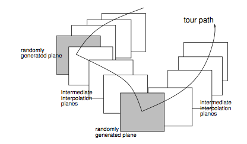
]
.right-column[
- Visualisation of high-dimensions using tours: the [tourr](https://cran.r-project.org/web/packages/tourr/index.html) package
    - *Grand:* Randomly choose target
    - *Little:* Basis of *d* of the *p* variables
    - *Local:* Randomly within a small radius 
    - *Guided:* Define structure of interest in projection, and optimise function
    - *Manual:* Control the contribution of a single variable, and move along this axis  (coming soon in the R package `spinifex`)
- A library of high-dimensional shapes: the [geozoo](https://cran.r-project.org/web/packages/geozoo/index.html) package, and paper [Escape from Boxland](https://journal.r-project.org/archive/2016/RJ-2016-044/index.html)
]

---
# Philosophy

- It is common to show the data in the model space, for example, predicted vs observed plots for regression, linear discriminant plots, and principal components.
- By displaying the model in the high-d data space, rather than low-d
summaries of the data produced by the model, we expect to better understand the fit.

.footnote[Wickham et al (2015) Visualizing statistical models: Removing the blindfold, SAM]


---
# Hierarchical clustering
Dendrogram: .red[data] in the .red[model space]

.pull-left[
```{r echo=FALSE, fig.width=6, fig.height=6}
source("dend_util.R")
data(flea)
flea_std <- rescaler(flea[,-7])
plot(hclust(dist(flea_std), method="single"), hang=-1)
```
]
.pull-right[
```{r echo=FALSE, fig.width=6, fig.height=6}
plot(hclust(dist(flea_std), method="ward.D2"), hang=-1)
```
]

---

Tour: .red[Model] in the .red[data space]

```{r eval=FALSE, echo=FALSE}
# Code adapted from library(clusterfly)
flea_hc_s <- hierfly(flea, method="single")
flea_hc_w <- hierfly(flea)

bases <- save_history(flea_hc_s$data[, 1:6], max = 10)
tour_path <- interpolate(bases, 0.1)
d <- dim(tour_path)
hcs <- NULL
hcse <- NULL
hcw <- NULL
hcwe <- NULL
for (i in 1:d[3]) {
  #cat(i, "\n")
  d1 <- as.matrix(flea_hc_s$data[, 1:6]) %*% matrix(tour_path[,,i], ncol=2)
  colnames(d1) <- c("x", "y")
  hcs <- rbind(hcs, cbind(d1, flea_hc_s$data[,7], rep(i+10, nrow(d1))))
  d2 <- as.matrix(flea_hc_w$data[, 1:6]) %*% matrix(tour_path[,,i], ncol=2)
  colnames(d2) <- c("x", "y")
  hcw <- rbind(hcw, cbind(d2, flea_hc_w$data[,7], rep(i+10, nrow(d2))))
  e1 <- cbind(d1[flea_hc_s$edges[,1],1],
              d1[flea_hc_s$edges[,2],1],
              d1[flea_hc_s$edges[,1],2],
              d1[flea_hc_s$edges[,2],2], 
              flea_hc_s$data[flea_hc_s$edges[,1], 7],
              rep(i+10, nrow(flea_hc_s$edges)))
  colnames(e1) <- c("x", "xend", "y", "yend", "species", "indx")
  hcse <- rbind(hcse, e1)
  e2 <- cbind(d2[flea_hc_w$edges[,1],1],
              d2[flea_hc_w$edges[,2],1],
              d2[flea_hc_w$edges[,1],2],
              d2[flea_hc_w$edges[,2],2], 
              flea_hc_w$data[flea_hc_w$edges[,1], 7],
              rep(i+10, nrow(flea_hc_w$edges)))
  colnames(e2) <- c("x", "xend", "y", "yend", "species", "indx")
  hcwe <- rbind(hcwe, e2)
}
colnames(hcs)[3:4] <- c("species", "indx")
colnames(hcw)[3:4] <- c("species", "indx")
hcs <- as.tibble(hcs)
hcw <- as.tibble(hcw)
hcs$species <- as.factor(hcs$species)
hcw$species <- as.factor(hcw$species)
hcse <- as.tibble(hcse)
hcwe <- as.tibble(hcwe)
hcse$species <- as.factor(hcse$species)
hcwe$species <- as.factor(hcwe$species)
#save(df, file="data/s5_t.rda")
#library(plotly)
#load("data/s5_t.rda")
p <- ggplot(data = hcs, aes(x = x, y = y) ) +
       geom_point(aes(frame = indx, colour=species), size=1) +
       theme_void() +
       coord_fixed() +
       geom_segment(data = hcse, aes(x=x, xend=xend, y=y, yend=yend, frame = indx, colour=species)) + theme(legend.position="none")
pg <- ggplotly(p, width=500, height=500) %>% animation_opts(200, redraw = FALSE, easing = "linear")
save_html(pg, file="single.html")

p <- ggplot(data = hcw, aes(x = x, y = y) ) +
       geom_point(aes(frame = indx, colour=species), size=1) +
       theme_void() +
       coord_fixed() +
       geom_segment(data = hcwe, aes(x=x, xend=xend, y=y, yend=yend, frame = indx, colour=species)) + theme(legend.position="none")
pg <- ggplotly(p, width=500, height=500) %>% animation_opts(200, redraw = FALSE, easing = "linear")
save_html(pg, file="ward.html")
```

.pull-left[
<iframe src="single.html" width="400" height="500" scrolling="yes" seamless="seamless" frameBorder="0"> </iframe>
]
.pull-right[
<iframe src="ward.html" width="400" height="500" scrolling="yes" seamless="seamless" frameBorder="0"> </iframe>
]


```{r eval=FALSE, echo=FALSE}
library(randomForest)
data(olive)
olive_sub <- olive %>% filter(region==1) %>%
  select(-region) %>% mutate(area=factor(area))
olive_rf <- randomForest(area~., data=olive_sub)
votes <- f_composition(olive_rf$votes)
colnames(votes) <- paste0("V", 1:3)
votes <- cbind(votes, area=olive_sub$area)
sp3$points <- cbind(sp3$points, area=c(5,5,5,5))
votes <- rbind(sp3$points, votes)
pal <- ochre_palettes$lorikeet[c(2,3,4,6)]
col <- pal[votes[,4]]

animate(votes[,-4], grand_tour(), 
        display_xy(axes = "bottomleft", col=col, edges=sp3$edges))

olive_rf <- randomForest(area~., 
                         data=olive_sub)
votes <- f_composition(olive_rf$votes)
animate(votes[,-4], grand_tour(), 
        display_xy(axes = "bottomleft", 
                   col=col, edges=sp3$edges))
```


---
# Summary

- The tourr package is available for you to look beyond 2D
- High-dimensional shapes, how they are defined, what they look like, how they differ is interesting
- Think about ways to look at the model in the data space

---
# Multidimensional physics

You can read what we are doing with physics data here:

[Dynamical projections for the visualization of PDFSense data](https://arxiv.org/abs/1806.09742)

Dianne Cook, Ursula Laa, German Valencia


---

class: inverse 

# Joint work!

- *Tours:* Andreas Buja, Debby Swayne, Heike Hofmann, Hadley Wickham, Ursula Laa and Nick Spyrison
- *Library of high-d shapes:* Barret Schloerke
- *Physics application:* Ursula Laa, German Valencia
- Animations made with the R [plotly](https://plotly-book.cpsievert.me) package, by Carson Sievert

Contact: [`r icon::fa_envelope()`](http://www.dicook.org) dicook@monash.edu, [`r icon::fa_twitter()`](https://twitter.com/visnut) visnut, [`r icon::fa_github()`](https://github.com/dicook) dicook

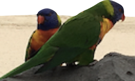

.footnote[Slides made with Rmarkdown, xaringan package by Yihui Xie, and lorikeet theme using the [ochRe package](https://github.com/ropenscilabs/ochRe). Available at [https://github.com/dicook/ISCBASC2018](https://github.com/dicook/ISCBASC2018].)

---
# Further reading

- Buja et al (2004) [Computational Methods for High-Dimensional Rotations in Data Visualization](http://stat.wharton.upenn.edu/~buja/PAPERS/paper-dyn-proj-algs.pdf) 
- Cook, D., and Swayne, D. [Interactive and Dynamic Graphics for Data Analysis with examples using R and GGobi](http://www.ggobi.org)
- Wickham et al (2011) [tourr: An R Package for Exploring Multivariate Data with Projections](http://www.jstatsoft.org/v40)
- Wickham et al (2015) Visualising Statistical Models: Removing the Blindfold (with Discussion), Statistical Analysis and Data Mining.
- Schloerke, et al (2016) [Escape from Boxland](https://journal.r-project.org/archive/2016/RJ-2016-044/ index.html)


---
class: middle center

<a rel="license" href="http://creativecommons.org/licenses/by-sa/4.0/"></a><br />This work is licensed under a <a rel="license" href="http://creativecommons.org/licenses/by-sa/4.0/">Creative Commons Attribution-ShareAlike 4.0 International License</a>.

