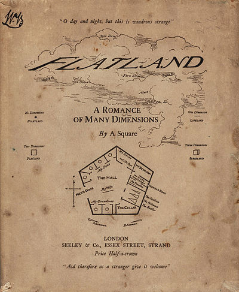

```{r initial, echo = FALSE, cache = FALSE, warning = FALSE, message = FALSE, error=FALSE, results = 'hide'}
library(knitr)
options(htmltools.dir.version = FALSE, tibble.width = 60)
knitr::opts_chunk$set(
  echo = TRUE, 
  warning = FALSE, 
  message = FALSE, 
  error=FALSE, 
  comment = "#>",
  collapse = TRUE,
  fig.path = 'figure/', 
  cache.path = 'cache/', 
  fig.align = 'center', 
  fig.width = 10, 
  fig.height = 7, 
  fig.show = 'hold', 
  cache = TRUE, 
  external = TRUE, 
  dev = 'svglite'
)
library(tidyverse)
library(ochRe)
library(tourr)
library(geozoo)
library(htmltools)
library(gridExtra)
library(plotly)
```

background-image: url(img/You_can't_see_beyond_3D.png)
background-size: contain

.left-column[
# High-dimensions
### You can't see beyond 3D
]
.right-column[


]

---
.left-column[
# High-dimensions
### You can't see beyond 3D
### A universe of 10 dimensions
]
.right-column[


Source: https://ultraculture.org/blog/2014/12/16/heres-visual-guide-10-dimensions-reality/
]

---
.left-column[
# High-dimensions
### You can't see beyond 3D
### A universe of 10 dimensions
]
.right-column[


Source: https://ultraculture.org/blog/2014/12/16/heres-visual-guide-10-dimensions-reality/
]

---
.left-column[
# High-dimensions
### You can't see beyond 3D
### A universe of 10 dimensions
]
.right-column[


Source: https://ultraculture.org/blog/2014/12/16/heres-visual-guide-10-dimensions-reality/
]

---
.left-column[
# High-dimensions
### You can't see beyond 3D
### A universe of 10 dimensions
]
.right-column[


Source: https://ultraculture.org/blog/2014/12/16/heres-visual-guide-10-dimensions-reality/
]

---
.left-column[
# High-dimensions
### You can't see beyond 3D
### A universe of 10 dimensions
]
.right-column[


Source: https://ultraculture.org/blog/2014/12/16/heres-visual-guide-10-dimensions-reality/
]

---
.left-column[
# High-dimensions
### You can't see beyond 3D
### A universe of 10 dimensions
]
.right-column[


Source: https://ultraculture.org/blog/2014/12/16/heres-visual-guide-10-dimensions-reality/
]

---
.left-column[
# High-dimensions
### You can't see beyond 3D
### A universe of 10 dimensions
]
.right-column[


Source: https://ultraculture.org/blog/2014/12/16/heres-visual-guide-10-dimensions-reality/
]

---
.left-column[
# High-dimensions
### You can't see beyond 3D
### A universe of 10 dimensions
]
.right-column[


Source: https://ultraculture.org/blog/2014/12/16/heres-visual-guide-10-dimensions-reality/
]

---
class: inverse middle center

[Its not like that at all!](https://media1.tenor.com/images/d4c398703092842d4d17020b5414b0ee/tenor.gif?itemid=4995777)

---

.left-column[
# High-dimensions
### You can't see beyond 3D
### A universe of 10 dimensions
### Its more like...

[Flatland: A Romance of Many Dimensions (1884) Edwin Abbott Abbott](https://en.wikipedia.org/wiki/Flatland) 

]
.pull-right[


<p> 

The story describes a two-dimensional world occupied by geometric figures, where women are simple line-segments, and men are polygons with various numbers of sides.
]

---
# How we see high-dimensions in statistics..


Increasing dimension adds an additional orthogonal axis. 

<p>If you want more high-dimensional shapes there is an R package, [geozoo](http://schloerke.com/geozoo/all/), which will generate cubes, spheres, simplices, mobius strips, torii, boy surface, enneper surface, dini surface, klein bottles, cones, various polytopes, ... 

---
.left-column[
# High-dimensions
### You can't see beyond 3D
### A universe of 10 dimensions
### Its more like...
### And in statistics it is everywhere

]
.pull-right[
- Principal component analysis
- Multidimensional scaling
- Factor analysis
- Projection pursuit
- Regression
- Linear discriminant analysis
- Cluster analysis
- Multivariate distributions
- Posterior distributions in Bayesian models
]

---
class: center

```{r eval=FALSE, echo=FALSE, warning=FALSE}
s5 <- sphere.hollow(p=5)$points[1:500,]
colnames(s5) <- paste0("V", 1:5)
c5 <- cube.face(p = 5)
c5 <- c5$points[sample(1:nrow(c5$points), 500),]
c5 <- (c5 - 0.5) * 1.4
colnames(c5) <- paste0("V", 1:5)
bases <- save_history(c5, grand_tour(2),
                      max = 3)
tour_path <- interpolate(bases, 0.1)
d <- dim(tour_path)
mydat <- NULL
for (i in 1:d[3]) {
  #cat(i, "\n")
  s5p <- s5 %*% matrix(tour_path[,,i], ncol=2)
  s5p <- cbind(s5p, rep("sphere", 500))
  colnames(s5p) <- c("x", "y", "shape")
  c5p <- c5 %*% matrix(tour_path[,,i], ncol=2)
  c5p <- cbind(c5p, rep("cube", 500))
  colnames(c5p) <- c("x", "y", "shape")
  s5c5 <- rbind(s5p, c5p)
  mydat <- rbind(mydat, cbind(s5c5, rep(i+10, 2*nrow(s5p))))
}
colnames(mydat)[4] <- "indx"
df <- as.tibble(mydat)
df$x <- as.numeric(df$x)
df$y <- as.numeric(df$y)
#save(df, file="data/s5_t.rda")
library(plotly)
#load("data/s5_t.rda")
p <- ggplot(data = df, aes(x = x, y = y) ) +
       geom_point(aes(frame = indx), size=0.5) +
       facet_wrap(~shape) +
       theme_void() +
       coord_fixed()
pg <- ggplotly(p, width=600, height=400) %>%
  animation_opts(200, redraw = FALSE, 
                 easing = "linear", transition=0)
save_html(pg, file="s5.html")
```

<iframe src="s5.html" width="800" height="500" scrolling="yes" seamless="seamless" frameBorder="0"> </iframe>

Can you tell the difference between these 5D objects?
--
<p>
.red[  Yep? You can see beyond 3D!]

---
class: center

```{r eval=FALSE, echo=FALSE}
library(multiDA)
library(tidyverse)
data(SRBCT)
vy   <- SRBCT$vy
mX   <- SRBCT$mX
res  <- multiDA(mX, vy, penalty="EBIC", equal.var=TRUE, set.options="exhaustive")
x<-res
rownames(x$res$mGamma)<-as.character(1:nrow(x$res$mGamma))
colnames(x$mX)<-rownames(x$res$mGamma)

inds<-which(apply(x$res$mGamma,1,which.max)!=1) #non null cases
est.gamma<-apply(x$res$mGamma[inds,],1,max)

df<-data.frame("est.gamma"=est.gamma, "rank"=rank(-est.gamma),"partition"=apply(x$res$mGamma,1,which.max)[inds])

df <- df[order(df$rank),]
keep <- rownames(df)[1:10]

SRBCT_sub1 <- SRBCT$mX[,as.numeric(keep)]
colnames(SRBCT_sub1) <- paste("V",keep)

SRBCT_sub2 <- SRBCT$mX[,sample(1:1586, 10)]
colnames(SRBCT_sub2) <- paste("V",keep)

bases <- save_history(SRBCT_sub1, grand_tour(2),
                      max = 3)
tour_path <- interpolate(bases, 0.1)
d <- dim(tour_path)
mydat <- NULL
for (i in 1:d[3]) {
  #cat(i, "\n")
  s1 <- SRBCT_sub1 %*% matrix(tour_path[,,i], ncol=2)
  s1 <- cbind(s1, rep("A", nrow(SRBCT_sub1)), SRBCT$vy)
  colnames(s1) <- c("x", "y", "set", "gene")
  s2 <- SRBCT_sub2 %*% matrix(tour_path[,,i], ncol=2)
  s2 <- cbind(s2, rep("B", nrow(SRBCT_sub2)), SRBCT$vy)
  colnames(s2) <- c("x", "y", "set", "gene")
  s5c5 <- rbind(s1, s2)
  mydat <- rbind(mydat, cbind(s5c5, rep(i+10, 2*nrow(s2))))
}
colnames(mydat)[5] <- "indx"
tb <- as.tibble(mydat)
tb$x <- as.numeric(tb$x)
tb$y <- as.numeric(tb$y)

p <- ggplot(data = tb, aes(x = x, y = y, colour=gene) ) +
       geom_point(aes(frame = indx), size=1) +
       facet_wrap(~set) +
       theme_void() +
       coord_fixed() + 
       theme(legend.position = "none")
pg <- ggplotly(p, width=600, height=400) %>%
  animation_opts(200, redraw = FALSE,
                 easing = "linear", transition=0)
save_html(pg, file="multiDA.html")
```

<iframe src="multiDA.html" width="700" height="400" scrolling="yes" seamless="seamless" frameBorder="0"> </iframe>

Can you tell the difference between these 10D objects?

--
<p>
.red[  Yep? You really can see beyond 3D!]
--
<p>
Set A are genes identified by Sarah Romanes [multiDA](https://github.com/sarahromanes/multiDA) procedure; set B are a random sample of genes. Sarah's selection are much more distinctly different than the random sample.

---
# Outline

- The tour algorithm: grand, guided, little, local, manual
- R packages: tourr, geozoo, spinifex
- Philosophy: model in the data space
- Applications: multiple time series, cluster analysis, exploring posterior distributions

---
# Tour algorithm


---
.left-column[
# Tours
### Definition
]
.right-column[
A .red[grand tour] is by definition a movie of low-dimensional projections constructed in such a way that it comes arbitrarily close to any low-dimensional projection; in other words, a grand tour is a space-filling curve in the manifold of low-dimensional projections of high-dimensional data spaces.


]

---

Allen Morris [A 3D object 2D shadows](https://www.youtube.com/watch?v=aetj-Q4FuWY)

<iframe width="560" height="315" src="https://www.youtube.com/embed/aetj-Q4FuWY" frameborder="0" allow="autoplay; encrypted-media" allowfullscreen></iframe>

---
.left-column[
# Tours
### Definition
### Notation
]
.right-column[
- ${\mathbf x}_i \in \Re^p$, $i^{th}$ data vector
- $d$ projection dimension
- $F$ is a $p\times d$ orthonormal frame, $F'F=I_d$
- The projection of ${\mathbf x}$ onto $F$ is ${\mathbf y}_i=F'{\mathbf x}_i$.
- Paths of projections are given by *continuous one-parameter* families $F(t)$, where $t\in [a, z]$. Starting and target frame denoted as $F_a = F(a), F_z=F(t)$.
- The animation of the projected data is given by a path ${\mathbf y}_i(t)=F'(t){\mathbf x}_i$.
]


---

.left-column[
# Tours
### Definition
### Notation
### Algorithm
]
.right-column[
- Given a starting frame $F_a$, create a new target frame $F_z$.
- Initialize interpolation. Generate planar rotations, $R({\mathbf \tau}) = R_m(\tau_m)...R_1(\tau_1), ~~~ {\mathbf \tau}=(\tau_1, ..., \tau_m)$ such that $F_z=R({\mathbf \tau})F_a$.
- Execute interpolation
    - $t \leftarrow min(1, t)$
    - $F(t)=R({\mathbf \tau}t)F_a$ (gives frame)
    - ${\mathbf y}_i(t)=F(t)'{\mathbf x}_i$
    - If $t=1$ break iteration, else $t\leftarrow t+\delta$
- Set $F_a=F_z$, start again
]


---
.left-column[
# Tours
### Definition
### Notation
### Algorithm
### Avoiding whip-spin
]
.right-column[


Rotation out of the projection frame, is defined by the principal basis in $F_a$ and $F_z$, defining the shortest distance between the planes, computed using singular value decomposition of $F_a'F_z=V_a\Lambda V_z'$, 

$$G_a=F_aV_a~~~,~~~ G_z=F_zV_z$$. 

]

---

.left-column[
# Tours
### Definition
### Notation
### Algorithm
### Avoiding whip-spin
### Choosing targets
]
.right-column[
- *Grand:* Randomly choose target
- *Little:* Basis of $d$ of the $p$ variables
- *Local:* Randomly within a small radius 
- *Guided:* Define structure of interest in projection, and optimise function
- *Manual:* Control the contribution of a single variable, and move along this axis  
]


---

.left-column[
# Tours
### Definition
### Notation
### Algorithm
### Avoiding whip-spin
### Choosing targets
### PP Guidance
]
.right-column[
- *Holes:* finds projections with hollow centres $I(F)= \frac{1-\frac{1}{n}\sum_{i=1}^{n}\exp(-\frac{1}{2}{\mathbf y}_i{\mathbf y}_i')}{1-\exp(-\frac{p}{2})}$
- *LDA:* finds separations between classes, classically $I(F) = 1- \frac{|F'WF|}{|F'(W+B)F|}$, where 
$B=\sum_{i=1}^gn_i(\bar{{\mathbf y}}_{i.}-\bar{{\mathbf y}}_{..})(\bar{{\mathbf y}}_{i.}-\bar{{\mathbf y}}_{..})'$ ,
$W=\sum_{i=1}^g\sum_{j=1}^{n_i}({\mathbf y}_{ij}-\bar{{\mathbf y}}_{i.})({\mathbf y}_{ij}-\bar{{\mathbf y}}_{i.})'$
- *PDA:* finds separations between classes, when there are many variables and few points $I(F, \lambda) = 1-\frac{|F'((1-\lambda)W+n\lambda I_p)F|}{|F'((1-\lambda)(B+W)+n\lambda I_p)F|}$
]


---

.left-column[
# Packages


]
.right-column[
- Visualisation of high-dimensions using tours: the [tourr](https://cran.r-project.org/web/packages/tourr/index.html) package
    - *Grand:* Randomly choose target
    - *Little:* Basis of *d* of the *p* variables
    - *Local:* Randomly within a small radius 
    - *Guided:* Define structure of interest in projection, and optimise function
    - *Manual:* Control the contribution of a single variable, and move along this axis  (coming soon in the R package `spinifex`)
- A library of high-dimensional shapes: the [geozoo](https://cran.r-project.org/web/packages/geozoo/index.html) package, and paper [Escape from Boxland](https://journal.r-project.org/archive/2016/RJ-2016-044/index.html)
]

---
# Philosophy

- It is common to show the data in the model space, for example, predicted vs observed plots for regression, linear discriminant plots, and principal components.
- By displaying the model in the high-d data space, rather than low-d
summaries of the data produced by the model, we expect to better understand the fit.

.footnote[Wickham et al (2015) Visualizing statistical models: Removing the blindfold, SAM]

---

.left-column[
# Example: Last 4 months of currency USD cross-rates
]
.right-column[
- Data extracted from http://openexchangerates.org/api/historical
- R packages `jsonlite`, processed with `tidyverse`, `lubridate`
- We are going to cluster the currencies
```{r echo=FALSE, fig.width=3, fig.height=2}
source("dend_util.R")
ru <- read_csv("data/rates_new.csv")
ru <- ru %>% arrange(date)

s <- apply(ru[,-1], 2, function(x) sd(x)/mean(x))

ru_sub <- ru[,which(s>0.005)+1]
ru_sub <- ru_sub[,-2]
ru_sub <- apply(ru_sub, 2, function(x) (x-mean(x))/sd(x))
ru_sub_t <- t(ru_sub)
ru_sub_t <- data.frame(ru_sub_t)
ru_sub_t$curr <- as.factor(colnames(ru_sub))
ggplot(ru, aes(x=date, y=AUD)) + geom_line()
```
]

---
# Hierarchical clustering
Dendrogram: .red[data] in the .red[model space]

.pull-left[
Ward's linkage
```{r echo=FALSE, fig.width=6, fig.height=6}
ru_hc_w <- hclust(dist(ru_sub_t[,-ncol(ru_sub_t)]), method="ward.D2")
plot(ru_hc_w, hang=-1)
```
]
.pull-right[
Average linkage
```{r echo=FALSE, fig.width=6, fig.height=6}
ru_hc_a <- hclust(dist(ru_sub_t[,-ncol(ru_sub_t)]), method="average")
plot(ru_hc_a, hang=-1)
```
]

---

Tour: .red[Model] in the .red[data space]

```{r echo=FALSE}
ru_pca <- prcomp(ru_sub_t[,-ncol(ru_sub_t)])
ru_hc_pc <- data.frame(ru_pca$x[,1:9])
ru_hc_pc$clw <- cutree(ru_hc_w, 4)
ru_hc_pc$cla <- cutree(ru_hc_a, 4)
ru_hc_pc$curr <- colnames(ru_sub)
```

```{r eval=FALSE, echo=FALSE}
# Code adapted from library(clusterfly)
ru_hc_pc$clw <- factor(ru_hc_pc$clw)
ru_hc_pc$cla <- factor(ru_hc_pc$cla)
rownames(ru_hc_pc) <- 1:nrow(ru_hc_pc)
ru_hc_w_hfly <- hierfly(ru_hc_pc[,-ncol(ru_hc_pc)], ru_hc_w)
ru_hc_a_hfly <- hierfly(ru_hc_pc[,-ncol(ru_hc_pc)], ru_hc_a)
pal <- brewer.pal(length(unique(ru_hc_w_hfly$data$clw)), "Dark2")
colw <- pal[ru_hc_hfly$data$clw]
cola <- pal[ru_hc_hfly$data$cla]
glyphs <- c(16, 46)
pchw <- glyphs[ru_hc_w_hfly$data$node+1]
pcha <- glyphs[ru_hc_a_hfly$data$node+1]
currw <- c(ru_hc_pc$curr, rep("", nrow(ru_hc_w_hfly$data) - nrow(ru_hc_pc)))
curra <- c(ru_hc_pc$curr, rep("", nrow(ru_hc_a_hfly$data) - nrow(ru_hc_pc)))
ru_hc_w_hfly$data$curr <- currw
ru_hc_a_hfly$data$curr <- curra
# Use plotly to make animation
bases <- save_history(ru_hc_w_hfly$data[, 1:4], max = 10)
tour_path <- interpolate(bases, 0.1)
d <- dim(tour_path)
hcw <- NULL
hcwe <- NULL
hca <- NULL
hcae <- NULL
for (i in 1:d[3]) {
  #cat(i, "\n")
  d1 <- as.matrix(ru_hc_w_hfly$data[,1:4]) %*% matrix(tour_path[,,i], ncol=2)
  colnames(d1) <- c("x", "y")
  d1 <- apply(d1, 2, function(x) x-mean(x))
  hcw <- rbind(hcw, cbind(d1, ru_hc_w_hfly$data$clw, ru_hc_w_hfly$data$node,                           rep(i+10, nrow(d1))))
  d2 <- as.matrix(ru_hc_a_hfly$data[,1:4]) %*% matrix(tour_path[,,i], ncol=2)
  colnames(d2) <- c("x", "y")
  d2 <- apply(d2, 2, function(x) x-mean(x))
  hca <- rbind(hca, cbind(d2, ru_hc_a_hfly$data$cla, ru_hc_a_hfly$data$node,                           rep(i+10, nrow(d2))))
  e1 <- cbind(d1[ru_hc_w_hfly$edges[,1],1],
              d1[ru_hc_w_hfly$edges[,2],1],
              d1[ru_hc_w_hfly$edges[,1],2],
              d1[ru_hc_w_hfly$edges[,2],2],
              ru_hc_w_hfly$data$clw[ru_hc_w_hfly$edges[,1]],
              rep(i+10, nrow(ru_hc_w_hfly$edges)))
  colnames(e1) <- c("x", "xend", "y", "yend", "cl", "indx")
  hcwe <- rbind(hcwe, e1)
  e2 <- cbind(d2[ru_hc_a_hfly$edges[,1],1],
              d2[ru_hc_a_hfly$edges[,2],1],
              d2[ru_hc_a_hfly$edges[,1],2],
              d2[ru_hc_a_hfly$edges[,2],2],
              ru_hc_a_hfly$data$cla[ru_hc_a_hfly$edges[,1]],
              rep(i+10, nrow(ru_hc_a_hfly$edges)))
  colnames(e2) <- c("x", "xend", "y", "yend", "cl", "indx")
  hcae <- rbind(hcae, e2)
}
colnames(hcw)[3:5] <- c("cl", "node", "indx")
colnames(hca)[3:5] <- c("cl", "node", "indx")
hcw <- as.tibble(hcw)
hca <- as.tibble(hca)
hcw$cl <- as.factor(hcw$cl)
hca$cl <- as.factor(hca$cl)
hcw$node <- as.factor(hcw$node)
hca$node <- as.factor(hca$node)
hcw$currw <- rep(currw, d[3])
hca$curra <- rep(curra, d[3])
hcwe <- as.tibble(hcwe)
hcae <- as.tibble(hcae)
hcwe$cl <- as.factor(hcwe$cl)
hcae$cl <- as.factor(hcae$cl)
hcwe$currw <- ""
hcae$curra <- ""
#save(df, file="data/s5_t.rda")
#library(plotly)
#load("data/s5_t.rda")
p <- ggplot() +
  geom_segment(data = hcwe, aes(x=x, xend=xend, y=y, yend=yend, frame = indx, colour=cl, label=currw)) +
  geom_point(data = hcw, aes(x = x, y = y, frame = indx, colour=cl, shape=node, label=currw), size=1) +
  scale_shape_manual(values=c(16, 46)) +
  theme_void() +
  coord_fixed() +
  theme(legend.position="none") +
  scale_color_brewer("", palette="Dark2")
pg <- ggplotly(p, width=450, height=450) %>% animation_opts(200, redraw = FALSE, easing = "linear", transition=0)
save_html(pg, file="cluster_ward.html")

p <- ggplot() +
  geom_segment(data = hcae, aes(x=x, xend=xend, y=y, yend=yend, frame = indx, colour=cl, label=curra)) +
  geom_point(data = hca, aes(x = x, y = y, frame = indx, colour=cl, shape=node, label=curra), size=1) +
  scale_shape_manual(values=c(16, 46)) +
  theme_void() +
  coord_fixed() +
  theme(legend.position="none") +
  scale_color_brewer("", palette="Dark2")
pg <- ggplotly(p, width=450, height=450) %>% animation_opts(200, redraw = FALSE, easing = "linear", transition=0)
save_html(pg, file="cluster_average.html")
```

.pull-left[
<iframe src="cluster_ward.html" width="500" height="500" scrolling="yes" seamless="seamless" frameBorder="0"> </iframe>
]
.pull-right[
<iframe src="cluster_average.html" width="500" height="500" scrolling="yes" seamless="seamless" frameBorder="0"> </iframe>
]

---
# Clusters of currencies

Ward's linkage

```{r echo=FALSE, fig.width=10, fig.height=5}
p1 <- ggplot(ru_hc_pc, aes(x=PC1, y=PC2, colour=as.factor(clw), label=curr)) + geom_point() +
  scale_colour_brewer("", palette="Dark2") + 
  theme(legend.position="none")
ggplotly(p1)
ru_hc_ts <- data.frame(ru_sub)
ru_hc_ts$date <- ru$date
ru_hc_ts <- ru_hc_ts %>%
  gather(curr, val, -date) %>%
  left_join(select(ru_hc_pc, clw, cla, curr), by="curr")
p2 <- ggplot(ru_hc_ts, aes(x=date, y=val,
                      colour=factor(clw))) +
  geom_line(aes(group=curr), alpha=0.2) +
  facet_wrap(~clw) +
  geom_smooth(se=FALSE) +
  ylab("Std rate") +
  xlab("") +
  scale_colour_brewer("", palette="Dark2") + 
  theme(legend.position="none")
ggplotly(p2)
#grid.arrange(p1, p2, ncol=2)
```

---
# Clusters of currencies

Average linkage

```{r echo=FALSE, fig.width=10, fig.height=6}
p1 <- ggplot(ru_hc_pc, aes(x=PC1, y=PC2, colour=as.factor(cla))) + geom_point() +
  scale_colour_brewer("", palette="Dark2")
ru_hc_ts <- data.frame(ru_sub)
ru_hc_ts$date <- ru$date
ru_hc_ts <- ru_hc_ts %>%
  gather(curr, val, -date) %>%
  left_join(select(ru_hc_pc, clw, cla, curr), by="curr")
p2 <- ggplot(ru_hc_ts, aes(x=date, y=val,
                     colour=factor(cla))) +
  geom_line(aes(group=curr), alpha=0.2) +
  facet_wrap(~cla) +
  geom_smooth(se=FALSE) +
  ylab("Std rate") +
  xlab("") +
  scale_colour_brewer("", palette="Dark2")
grid.arrange(p1, p2, ncol=2)
```

```{r eval=FALSE, echo=FALSE}
library(randomForest)
data(olive)
olive_sub <- olive %>% filter(region==1) %>%
  select(-region) %>% mutate(area=factor(area))
olive_rf <- randomForest(area~., data=olive_sub)
votes <- f_composition(olive_rf$votes)
colnames(votes) <- paste0("V", 1:3)
votes <- cbind(votes, area=olive_sub$area)
sp3$points <- cbind(sp3$points, area=c(5,5,5,5))
votes <- rbind(sp3$points, votes)
pal <- ochre_palettes$lorikeet[c(2,3,4,6)]
col <- pal[votes[,4]]

animate(votes[,-4], grand_tour(), 
        display_xy(axes = "bottomleft", col=col, edges=sp3$edges))

olive_rf <- randomForest(area~., 
                         data=olive_sub)
votes <- f_composition(olive_rf$votes)
animate(votes[,-4], grand_tour(), 
        display_xy(axes = "bottomleft", 
                   col=col, edges=sp3$edges))
```


---
# Summary

- The tourr package is available for you to look beyond 2D
- High-dimensional shapes, how they are defined, what they look like, how they differ is interesting
- Think about ways to look at the model in the data space

---

class: inverse 

# Joint work!

- *Tours:* Andreas Buja, Debby Swayne, Heike Hofmann, Hadley Wickham, Ursula Laa and Nick Spyrison
- *Library of high-d shapes:* Barret Schloerke
- *Physics application:* Ursula Laa, German Valencia
- Animations made with the R [plotly](https://plotly-book.cpsievert.me) package, by Carson Sievert

Contact: [`r icon::fa_envelope()`](http://www.dicook.org) dicook@monash.edu, [`r icon::fa_twitter()`](https://twitter.com/visnut) visnut, [`r icon::fa_github()`](https://github.com/dicook) dicook


.footnote[Slides made with Rmarkdown, xaringan package by Yihui Xie, and lorikeet theme using the [ochRe package](https://github.com/ropenscilabs/ochRe). Available at [https://github.com/dicook/ISCBASC2018](https://github.com/dicook/ISCBASC2018].)

---
# Further reading

- Buja et al (2004) [Computational Methods for High-Dimensional Rotations in Data Visualization](http://stat.wharton.upenn.edu/~buja/PAPERS/paper-dyn-proj-algs.pdf) 
- Cook, D., and Swayne, D. [Interactive and Dynamic Graphics for Data Analysis with examples using R and GGobi](http://www.ggobi.org)
- Wickham et al (2011) [tourr: An R Package for Exploring Multivariate Data with Projections](http://www.jstatsoft.org/v40)
- Wickham et al (2015) Visualising Statistical Models: Removing the Blindfold (with Discussion), Statistical Analysis and Data Mining.
- Schloerke, et al (2016) [Escape from Boxland](https://journal.r-project.org/archive/2016/RJ-2016-044/ index.html)


---
class: middle center

<a rel="license" href="http://creativecommons.org/licenses/by-sa/4.0/"></a><br />This work is licensed under a <a rel="license" href="http://creativecommons.org/licenses/by-sa/4.0/">Creative Commons Attribution-ShareAlike 4.0 International License</a>.

